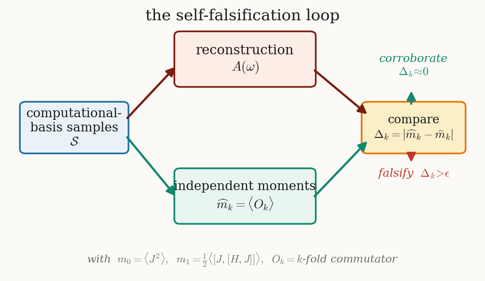
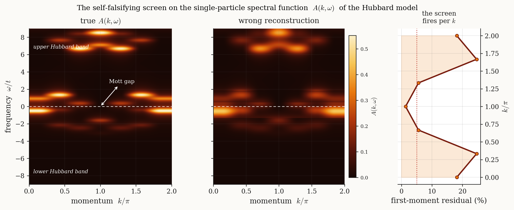
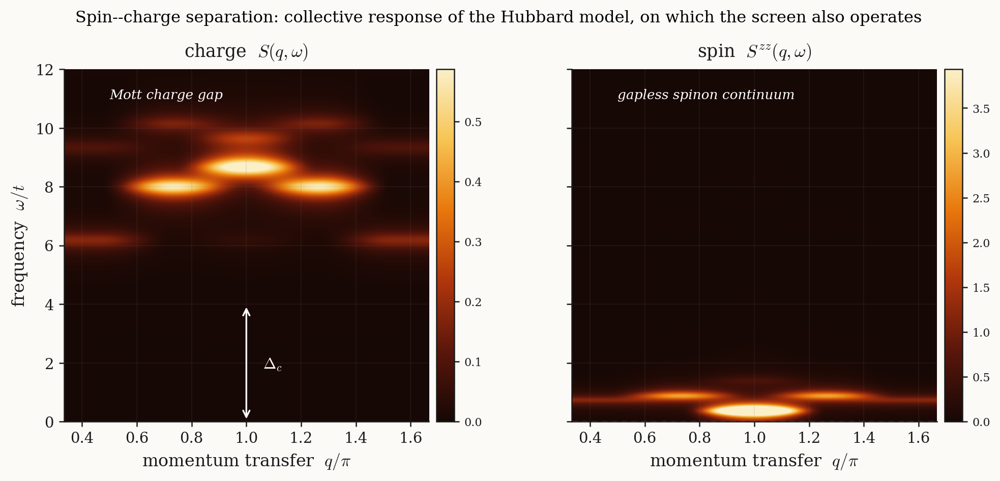
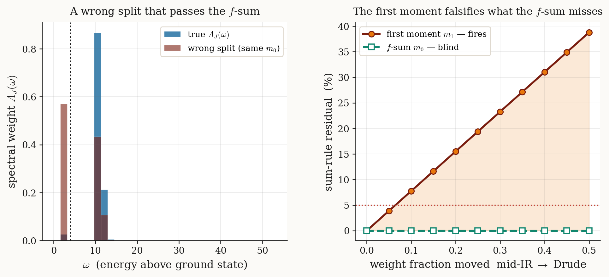
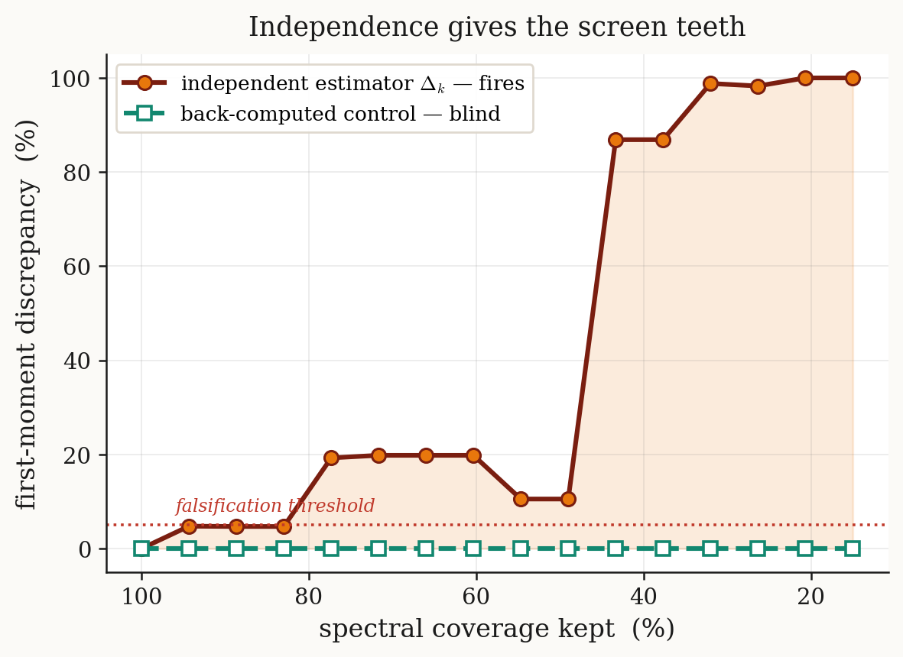
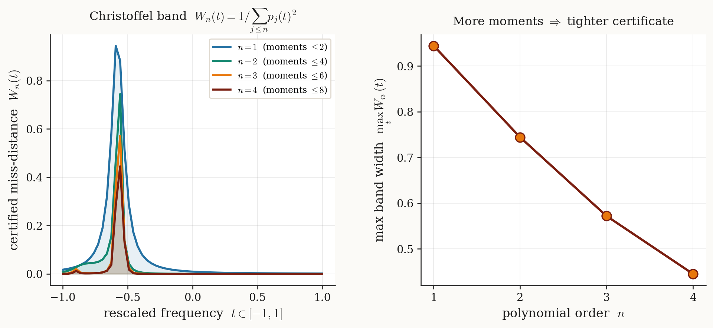
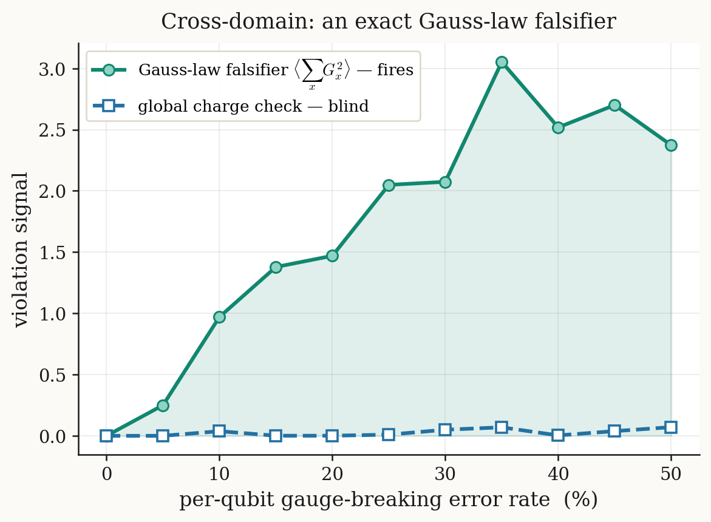
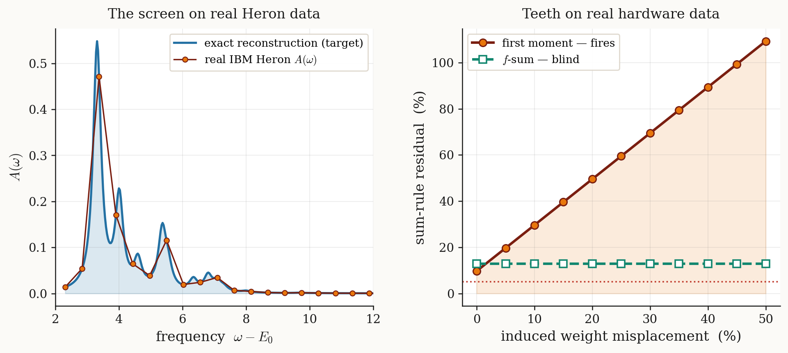

<div align="center">

# Self-falsifying quantum spectroscopy
### *a transportable necessary-condition screen for quantum-computed dynamical spectra*

**Nicolás Bonilla Vargas** &nbsp;[](https://orcid.org/0009-0006-6155-4391)

[](https://arxiv.org/a/bonillavargas_n_1)
[](paper/main.pdf)
[](LICENSE)
[](LICENSE)
[](requirements.txt)
[](docs/REPRODUCE.md)

</div>

> **One sentence.** A quantum-computed spectrum is most valuable exactly where classical simulation is
> intractable — and there it can least be confirmed — so we ship it not as a *certified* answer but as a
> *falsifiable* hypothesis, and attach a transportable battery of **reconstruction-independent** moment
> falsifiers that a wrong spectrum **could** fail (and a right one survives), with a closed-form Christoffel
> guarantee on what a pass certifies.

This repository is the **complete, reproducible record** of the paper. Every number, figure, and claim
traces to a script and a data file listed in [`docs/REPRODUCE.md`](docs/REPRODUCE.md) and
[`docs/FILE_INDEX.md`](docs/FILE_INDEX.md). A referee can regenerate every non-hardware result from source
with `numpy`/`scipy` alone, or run the whole pipeline end to end in one narrated notebook.

> **Companion works.** Data & pipeline — *Dynamical spectral functions from bitstring-sampled quantum
> subspaces* ([arXiv:2608.16436](https://arxiv.org/abs/2608.16436)). Review — *Machine learning for
> sample-based quantum diagonalization: generative configuration recovery and the classical-simulability
> frontier* ([arXiv:2608.05314](https://arxiv.org/abs/2608.05314)).

---

## Figure gallery

| The self-falsification loop | Single-particle `A(k,ω)` — the screen fires per momentum |
|:---:|:---:|
|  |  |
| **Spin–charge separation: `S(q,ω)` gapped, `S^zz` gapless** | **A wrong distribution of correct total weight** |
|  |  |
| **The teeth: independence vs a circular control** | **The Christoffel certified miss-distance** |
|  |  |
| **Cross-domain: the U(1) Gauss-law falsifier** | **Real IBM Heron demonstration** |
|  |  |

<div align="center"><em>The estimator branch is drawn deliberately <strong>not</strong> reading from A(ω) — the
property that gives the screen teeth: agreement was never preordained.</em></div>

---

## What the paper shows

1. **A change of stance, made operational.** A reconstructed spectrum `A(ω)` is shipped as a falsifiable
   hypothesis with a battery of **necessary-condition** falsifiers: static ground-state spectral moments
   `mₖ = ∫ωᵏA(ω)dω = ⟨Oₖ⟩` with `Oₖ = J·adₕᵏ(J)` (so `m₀ = ⟨J²⟩`, `m₁ = ½⟨[J,[H,J]]⟩`), estimated
   **independently** of the reconstruction from the *same* computational-basis samples and **never read back
   off `A(ω)`**. A pass is Popperian corroboration, never proof.

2. **Independence is what gives the screen teeth.** On sample-based-diagonalization subspace truncation the
   independent estimator fires while a back-computed (circular) control stays identically blind — the
   make-or-break contrast, demonstrated on real hardware data.

3. **Transportability across error classes and domains.** The same construction catches a spurious
   low-frequency (Drude-like) peak that preserves the total weight `m₀` yet fails the mean-frequency `m₁`,
   *and* a gauge-symmetry-breaking error via the exact U(1) Gauss-law identity `⟨∑G²⟩ = 0`.

4. **A closed-form guarantee.** Under exact moments the extremal spread in cumulative spectral weight is
   bounded by the **Christoffel function** `Wₙ(t) = 1/∑ⱼ pⱼ(t)²`, which contracts monotonically with moment
   order — a certified, computable resolution on the *integrated* weight (not a line shape).

5. **A robust, hardware-honest form.** The exact-moment idealization is replaced by a shot-budget interval
   test; a joint `(m₀,m₁,m₂)` + Hankel–Stieltjes **feasibility battery** removes the single-moment blind spot,
   forecast at the real `ibm_fez` 50k-shot budget.

**Honest scope (stated throughout).** The screen **falsifies, it does not certify**; its conditions are
**necessary, not sufficient**; it targets one error class (subspace truncation / weight misassignment), not
device noise in general; and **no quantum learning advantage is claimed** — at the demonstrated,
classically-reproducible scale the device is load-bearing for the *demonstration*, not the *science*.

---

## Repository structure

```
.
├── src/                                # exact-diagonalization engine + screen + figure exporters
│   ├── verify.py                       #   ★ fast smoke test (moments + the battery closing d=98), seconds
│   ├── spectral_lanczos.py             #   sector Lanczos + Haydock: A(k,ω), S(q,ω), S^zz, current probe, teeth
│   ├── interval_moment.py              #   shot-budget interval-moment forecast (ibm_fez 50k-shot budget)
│   ├── interval_battery.py             #   joint (m0,m1,m2)+Hankel battery — closes the single-moment blind spot
│   ├── run_heron_screen.py             #   the screen on real IBM Heron SQD data
│   ├── run_sumrule_falsifier.py …      #   the Drude / teeth / Gauss-law / Christoffel demonstrations
│   └── export_*.py, make_*.py          #   one data-driven generator per figure (no hand-typed numbers)
├── data/                               # authoritative plotted data (*.dat) + real Heron spectra (*.json)
├── notebooks/
│   └── 00_Reproduce_Everything.ipynb   #   ★ MASTER notebook: every figure & number, narrated end to end
├── paper/                              # arXiv-ready LaTeX source + compiled PDF
│   ├── main.tex, figstyle.tex, main.bbl#   master file + shared figure identity + frozen bibliography
│   ├── figs/                           #   native pgfplots fragments (.tex) + plotted data (.dat) + rasters
│   ├── main.pdf                        #   the compiled preprint (18 pp, 10 figures)
│   └── arxiv-submission.tar.gz         #   ready-to-upload source bundle (clean-room pdfLaTeX, 0 undefined)
├── docs/
│   ├── REPRODUCE.md                    #   figure/number → script → exact command
│   ├── FILE_INDEX.md                   #   every file, described
│   ├── ARXIV_SUBMISSION.md             #   the verified upload bundle + metadata + step-by-step
│   └── img/                            #   README thumbnails
├── requirements.txt · Makefile · CITATION.cff · LICENSE
```

---

## Quick start

```bash
# 1. environment
python -m venv .venv && source .venv/bin/activate      # (Windows: .venv\Scripts\activate)
pip install -r requirements.txt

# 2. reproduce the headline in SECONDS (numpy/scipy only):
#    the current-probe moments, the shot-budget interval, and the joint battery REJECTING the
#    truncation the lone first moment misses (d=98).
python src/verify.py        # or: make verify

# 3. reproduce EVERYTHING in one coherent, narrated pass — every figure and number, top to bottom
jupyter notebook notebooks/00_Reproduce_Everything.ipynb    # or headless: make reproduce

# 4. regenerate the native figure data from the exact engine
make figures

# 5. build the paper (needs a TeX distribution, e.g. TeX Live / MiKTeX)
make paper                              # -> paper/main.pdf   (uses the committed main.bbl; no bibtex)
```

**Posting to arXiv?** The upload-ready bundle `paper/arxiv-submission.tar.gz` compiles clean-room with
`pdflatex` alone (18 pp, 0 undefined refs, 100% ASCII source, `\pdfoutput=1`, `.bbl` included) — see
**[`docs/ARXIV_SUBMISSION.md`](docs/ARXIV_SUBMISSION.md)** for the verification, metadata and step-by-step.

---

## Reproducibility at a glance

| Layer | Reproducible here? | How |
|---|---|---|
| **Everything, one coherent pass** | ✅ narrated, end to end | `notebooks/00_Reproduce_Everything.ipynb` (or `make reproduce`) |
| **Exact diagonalization** (`A(k,ω)`, `S(q,ω)`, `S^zz`, the current-response falsifier, the teeth, the Christoffel certificate) | ✅ fully, locally | `python src/<script>.py`; see `docs/REPRODUCE.md` |
| **Interval-moment forecast + joint battery** | ✅ fully | `src/interval_moment.py`, `src/interval_battery.py` |
| **Figures** | ✅ fully | `make figures` (native pgfplots from the exact engine) |
| **IBM Heron screen** | ✅ on cached companion data | `src/run_heron_screen.py` on `data/heron_spectral.json` (re-running the device needs an IBM Quantum account) |

Every result but the hardware acquisition is an **exact classical simulation** reproducible from this
repository; the Heron demonstration runs the screen on the cached spectral data of the companion study.

---

## 🔒 Security note (please read before pushing)

This repository contains **no secrets**. Any IBM Quantum hardware re-run uses **your own** credentials
(`QiskitRuntimeService.save_account` locally, or an environment variable) — never commit a token.

---

## Citation

If you use this work, please cite it (see [`CITATION.cff`](CITATION.cff)):

```bibtex
@article{BonillaVargas2026SelfFalsifying,
  title   = {Self-falsifying quantum spectroscopy: a transportable necessary-condition
             screen for quantum-computed dynamical spectra},
  author  = {Bonilla Vargas, Nicol\'as},
  journal = {arXiv preprint},
  year    = {2026}
}
```

## License

- **Code** (`*.py`, `notebooks/`, `Makefile`): [MIT](LICENSE).
- **Paper text and figures** (`paper/`): [CC-BY-4.0](LICENSE).
